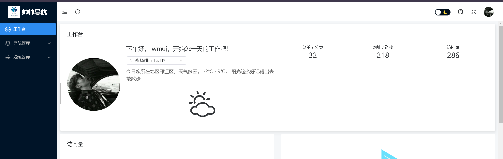
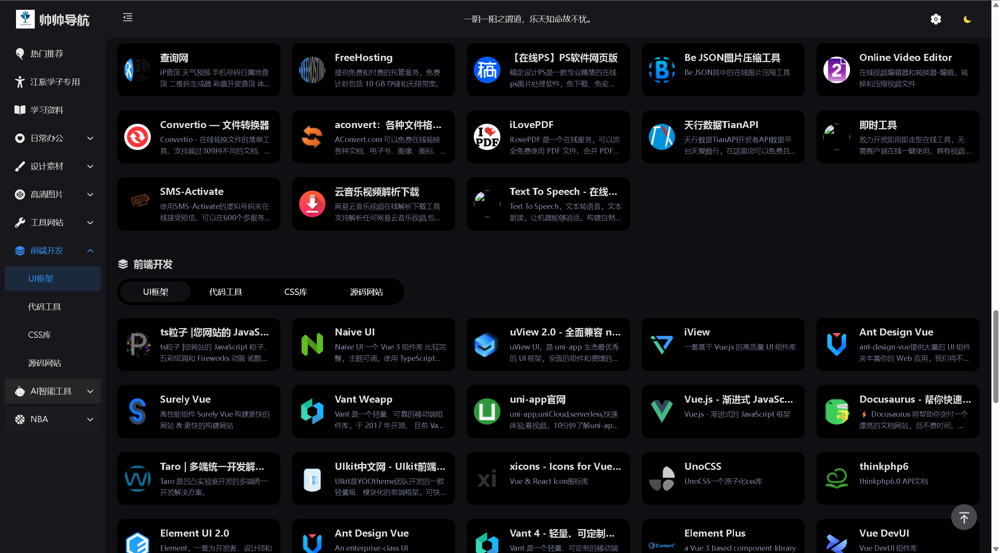
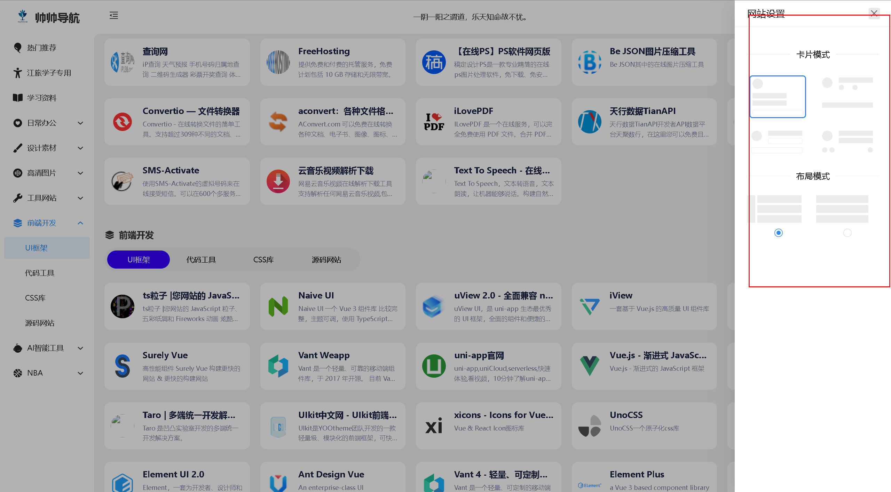
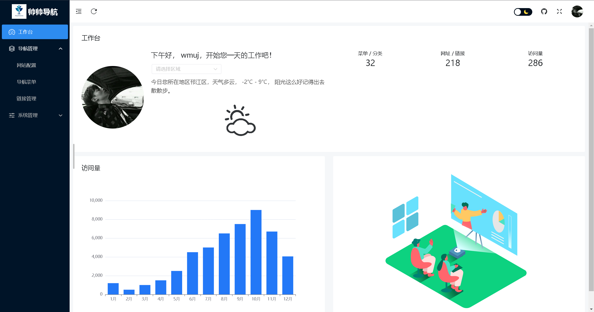

##

    
  </a>
   
  <b>帅帅导航</b>
  
一款基于Vue3、Vite、Naive-UI和ThinkPHP6.0的前后台分离的简洁

  
 自适应开源导航网站，包含多种页面布局和卡片模式，优化内容提升用户体验。

 
 

## 使用须知

- 本人是前端小菜鸟，欢迎各位大神来指导！！！
- 帅帅导航目前为v4.0.0版本，后会继续更新增加新功能；也欢迎大家提出宝贵建议。
- 现在后台管理系统增加了天气查询。欢迎大家使用呦

## 图标

## 预览

**主题**

- [帅帅导航 在线预览](https://wsq.wuaze.com/)
  
- [帅帅导航后台 在线预览](https://wsq.wuaze.com/admin) 
  账号：test，密码：123456
  
    
    
   
    
   
    
    
    

## 特性

`帅帅导航` 一款简约的综合性导航网站，摆脱书签很多无法找寻的困扰，追求自由、完美的你。
后台系统由 `帅帅计划` 强力驱动，后台带有角色人员管理等，可自行开发对接其他项目；后台系统不止是帅帅导航的后台，更是项目综合平台。

- 🏷️ 内置 `180+` 实用网站。
- 🏷️ 三叉树分类、结构清晰、分类清晰。
- 🏷️ 支持一个网站关联多个菜单
- 🏷️ 颜值与简约并存，多种模式。
- 🏷️ 完全开源，轻松定制化。
- 🏷️ 支持多种浏览模式，创新。
- 🏷️ 支持移动端浏览。
- 🏷️ 支持搜索查询。
- 🏷️ 支持自定义引擎搜索。
- 🏷️ 支持暗黑模式。
- 🏷️ 支持后台管理。

# 获取代码和指导
QQ：1486459292  V：wmuj_0701

## 仓库和博客地址
GIthub：https://github.com/wmuj 
GITEE：https://gitee.com/wang-shuai-qiang 
CSDN: https://blog.csdn.net/wmuj_?spm=1000.2115.3001.5343
